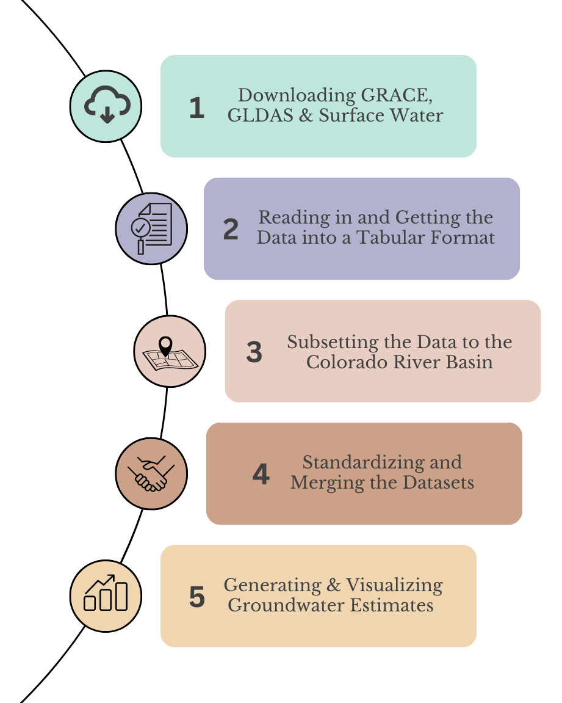

## Methodology for Calculating Groundwater Anamolies

For this project, we use satellite data and ground-based observation data to estimate groundwater anamolies for the Colorado River Basin. Our first step was to download the appropriate GRACE data from [NASA](https://grace.jpl.nasa.gov/data/get-data/jpl_global_mascons/), GLDAS data from [NASA](https://hydro1.gesdisc.eosdis.nasa.gov/data/GLDAS/GLDAS_NOAH025_M.2.1/doc/README_GLDAS2.pdf), and Surface Water datasets from [USGS](https://waterdata.usgs.gov/nwis) and [USBR](https://www.usbr.gov/uc/water/hydrodata/nav.html). Our next step is to read in all the data and get them into a tabular format. Once we have the data in a tabular format, we then subset to our region of interest--the Colorado River Basin. Finally, we standardize the units of measurement and resolution of these datasets and merge them together to create an estimate of groundwater anamolies for the region. This process is visualized below: 

After this, we analyzed and visualized groundwater changes and validated our findings with [x,y,z]. 
