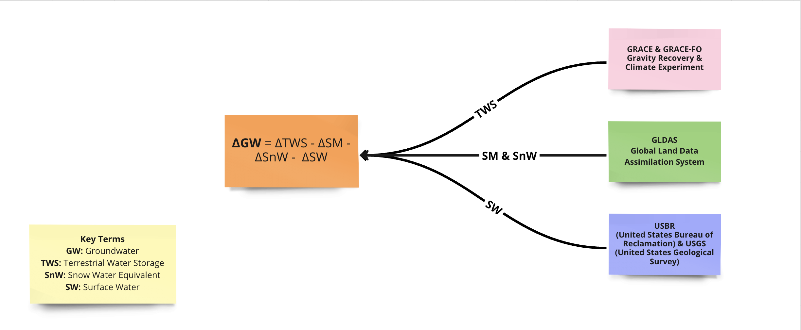

#  Unraveling the Mystery of Groundwater Measurement

Traditionally, governmental bodies and water agencies relied on [in situ measurement](https://www.usgs.gov/faqs/how-can-i-find-depth-water-table-specific-location#:~:text=The%20most%20reliable%20method%20of,placing%20electric%20or%20acoustic%20probes.)  to monitor groundwater in the U.S. such as the ones available from USGS. However, such approach has several limitations:
- Groundwater can only be monitored in places where monitoring wells are available, making wells drilled on private property difficult to monitor (JPL)[^1].
[^1]: https://grace.jpl.nasa.gov/applications/groundwater/
- Drilling monitoring wells can be time consuming and costly across large areas (National Academy of Sciences)[^2].
[^2]: https://nap.nationalacademies.org/read/25754/

Scientists have responded to these constraints by turning to space. More specifically, they use the Gravity Recovery and Climate Experiment (GRACE) and the Gravity Recovery and Climate Experiment Follow-On (GRACE-FO) data collected by NASA. These datasets track changes in terrestrial water storage around the globe, encompassing water found in lakes, rivers, soil, snowpack, and underground aquifers. By combining GRACE with other datasets that provide measurements on soil moisture, snowpack, and surface water, we can create estimates of groundwater anamolies. 

## The Formula and Datasets

The formula to derive groundwater measurement using GRACE data and other datasets is as follows:

$$\Delta Groundwater = \Delta Terrestrial Water Storage - \Delta SoilMoisture - \Delta Snow Water Equivalent - \Delta Surface Water$$

We list the datasets used to derive each variable in the image below:

## Digging Deeper: 

### What are GRACE and GRACE-FO?

The GRACE mission, a collaboration between NASA and German space agencies (DLR), is designed to track changes in Earth's gravity field by monitoring the distance between two satellites orbiting our planet. By utilizing specific models, scientists can convert changes in the gravity field into changes in Earth's terrestrial water storage. Initiated in March 2002 and concluded in October 2017, the GRACE mission provided critical data on a monthly basis. Picking up where GRACE left off, GRACE-FO was launched in May 2018 to continue this important work.

Interested in the finer details of how GRACE and GRACE-FO measure changes in terrestrial water storage? Continue reading the following section. If not, feel free to proceed to the next page to start exploring the data.

### What is GLDAS?

GLDAS uses advanced land surface modelling and data assimilation techniques on satellite and ground-based observational data to generate optimal fields of land surface states and fluxes. Currently, GLDAS drives three land surface models (LSMs): Noah, Catchment (CLSM), and the Variable Infiltration Capacity (VIC). The GLDAS-2 products are available at two temporal resolutions: 3-hourly and daily. The monthly products are generated through temporal averaging of the 3-hourly products. (For more detailed information, please refer to the [GLDAS handbook](https://hydro1.gesdisc.eosdis.nasa.gov/data/GLDAS/GLDAS_NOAH025_M.2.1/doc/README_GLDAS2.pdf)) from NASA GES DISC.

In our project, we have used the NOAH Land Surface Model. The NOAH Land Surface Model allows the researchers to compute groundwater using various levels of soil moisture (0-10 cm,10-40 cm,40-100 cm,100-200 cm). 

**Our project has used the following equation:**

$$
\Delta Groundwater = \Delta Terrestrial Water Storage - \Delta SoilMoisture - \Delta Snow Water Equivalent - \Delta Surface Water
$$

By utilizing our workflow, you can efficiently compute groundwater estimates through a more optimized approach. It involves data preprocessing, selective feature extraction, and other techniques to streamline the computation and reduce resource requirements.

Moreover, there are multiple equations for computing groundwater in the literature. Our workflow provides you with the freedom and resources to compute groundwater based on your equation of interest.

### What are the Bureau of Reclamation and the United States Geological Survey?

In our procedure, we employ the reservoir storage records from two agencies, the Bureau of Reclamation and the United States Geological Survey (USGS), to calculate surface water within the Colorado River Basin.

The Bureau of Reclamation, a federal entity under the U.S. Department of the Interior, is charged with the stewardship, development, and protection of water-related resources in the western U.S. This responsibility is subdivided into specific regions. For the purpose of our project, we are specifically focusing on the [HydroData database](https://www.usbr.gov/uc/water/hydrodata/reservoir_data/site_map.html#), maintained by the Upper Colorado Basin office.

On the other hand, the USGS serves as the scientific division of the U.S. Department of the Interior, providing a wealth of data related to earth science, water, biology, and mapping to facilitate informed decision-making. Their [Water Daily Data for the Nation](https://waterdata.usgs.gov/nwis/) database delivers water-related data collected from across the U.S. For the scope of this project, we are solely focusing on the surface water data contained within their database.

## Frequently Asked Questions about GRACE and GRACE-FO

**Q: How do scientists measure change in Earth's gravity fields?**

**A:** In both the GRACE and GRACE-FO missions, two satellites work in tandem, following each other and orbiting the Earth at a distance of about 137 miles (220 km). They continuously send microwaves to each other to measure their distance, accurate to a micron - about the diameter of a blood cell. When the satellites pass over an area with stronger gravitational pull (like a mountain), the gravity causes the leading satellite to accelerate, increasing the distance between the satellites. This distance reduces once they pass the area of stronger gravity. By detecting these distance changes and identifying where they occur, scientists can map the changes in gravity fields globally. More details can be found on the [GRACE website](https://grace.jpl.nasa.gov/mission/gravity-101/).

**Q: How do scientists derive changes in terrestrial water storage from changes in Earth's gravity fields?**

**A:** Gravity is a function of mass. By measuring changes in gravity, scientists can model changes in mass. Since most parts of Earth's surface are relatively static, changes in surface mass are primarily due to variations in water storage in hydrologic reservoirs, shifting ocean, atmospheric and land ice masses, and mass exchanges between these Earth system compartments. Once the change in Earth's gravity field data is recorded, scientists use specific models to solve for gravity variations. Initially, spherical harmonic solutions were the only solution employed. In 2015, mass concentration (mascon) solutions were also developed.

**Q: What's the difference between Mascon solution and spherical harmonic solutions?** 

**A:** Spherical harmonic solutions account for the Earth's oblate shape. Mascon solutions divide the earth into a grid. Each grid, or 'mascon', has a specific known geophysical location that isn't provided by each spherical harmonic coefficient. This allows scientists to be more precise in modeling and removes relevant errors in the processing step. Mascon solutions typically have less error and higher resolutions compared to spherical harmonic solutions. Different models with different assumptions mean they are suited for different use cases - the mascon solution is recommended for Hydrology applications. For an overview of the mechanisms of the two solutions, click [here](https://grace.jpl.nasa.gov/data/monthly-mass-grids/) to see NASA's overview of monthly mass grids. For a detailed comparison, visit [this site](https://grace.jpl.nasa.gov/data/choosing-a-solution/) titled "Which Grace(-FO) data set should I choose?."

**Q:  Why are measurements presented as changes rather than fixed numbers?**

**A:** GRACE cannot directly measure absolute water storage. Instead, it compares observations at a specific time point to a set time-mean baseline. This is done by first calculating the average for each grid point from 2004 to 2009, and then subtracting this value from each grid point for all time steps. The resulting data product varies around zero. A positive number at time point _yyyy-mm_ and location _lat-lon_ indicates more terrestrial water at that location compared to the 2004 to 2009 average. Further details on the computation process and units can be found [here](https://grace.jpl.nasa.gov/about/faq/).

**Q: Where can I find more information about GRACE and GRACE-FO?**

**A:** For more information that's relevant to hydrological information, you could refer to their [Level-3 Data Product User Handbook](https://deotb6e7tfubr.cloudfront.net/s3-edaf5da92e0ce48fb61175c28b67e95d/podaac-ops-cumulus-docs.s3.us-west-2.amazonaws.com/gracefo/open/docs/GRACE-FO_L3_Handbook_JPL.pdf?A-userid=None&Expires=1690241615&Signature=bNV~ixhHoOupQqiGtGhqH9Hfe7t7cc3OV7lpXOdLs0pOTMY1IgS2hYr2XRFtszFYucNVarcxrmIQGkwIB4CP5svHDiY3VuX4Gdy428RmNQ3BdAyiOhS6zxkkFJ77Osmu9t2P~JAu7CbijgeGxObAXtv9fsVb6sQgpllMB5PA9LplawrqBipZIs-84VX5CSDSFYIKZogv~d1jT8~AaE7I3GG79~osAsIaZ3v66OTDNJ4wHnjOLixptO5-85MrjtrHW07fQXXdyYfSLafNfDaFQCkaawGE1XZSpTSf8Krr0t~Zzl97wAUPzlvmr74HtWcHo6kuC70Qkzi9BLVkGADykA__&Key-Pair-Id=K353YVLLPST7AQ). Other documentations of GRACE and GRACE-FO mission are accessible [here](https://podaac.jpl.nasa.gov/gravity/gracefo-documentation).

**Q: Which version of GLDAS should I use?**

**A:** GLDAS has three components: GLDAS-2.0, GLDAS-2.1, and GLDAS 2.2.

The key difference among these versions lies in the data assimilation techniques they employ.

GLDAS-2.0 and GLDAS-2.1 are open-loop products, meaning they do not use data assimilation techniques. Data assimilation is a process that combines observational data with model simulations to improve the accuracy of the resulting output. In contrast, GLDAS-2.2 utilizes data assimilation techniques, making it a more advanced version compared to GLDAS-2.0 and GLDAS-2.1.

For our project, we have chosen to use GLDAS-2.2 because of its improved accuracy and the incorporation of observational data through data assimilation, which helps to provide more reliable land surface variables for analysis and decision-making.

##### References 

HydroData Database. [Map]. Retrieved August 17, 2023, from https://www.usbr.gov/uc/water/hydrodata/reservoir_data/site_map.html#

Jet Propulsion Laboratory (JPL). "Groundwater". Retrieved August 17, 2023, from https://grace.jpl.nasa.gov/applications/groundwater

National Academy of Sciences. "From Research to Reward: Amazing GRACE: A Satellite Mission Helps Us Measure and Track Water Underground." Retrieved August 17, 2023, from https://nap.nationalacademies.org/read/25754/

NASA. "Gravity 101." Retrieved August 17, 2023, from https://grace.jpl.nasa.gov/mission/gravity-101

NASA. "Overview—Monthly Mass Grids." GRACE Tellus. Retrieved August 17, 2023, from https://grace.jpl.nasa.gov/data/monthly-mass-grids

NASA. "Which GRACE(-FO) data set should I choose?" Retrieved August 17, 2023, from https://grace.jpl.nasa.gov/data/choosing-a-solution

NASA Goddard Earth Science Data Information and Services Center (GES DISC). "READ ME Document for NASA GLDAS Version 2 Data Products." (October 13, 2022). Retrieved August 17, 2023, from https://hydro1.gesdisc.eosdis.nasa.gov/data/GLDAS/GLDAS_NOAH025_M.2.1/doc/README_GLDAS2.pdf 

United States Geological Survey (USGS). "How can I find the depth to the water table in a specific location?" Retrieved August 17, 2023, from https://www.usgs.gov/faqs/how-can-i-find-depth-water-table-specific-location

USGS Water Data for the Nation. Retrieved August 17, 2023, from https://waterdata.usgs.gov/nwis/
