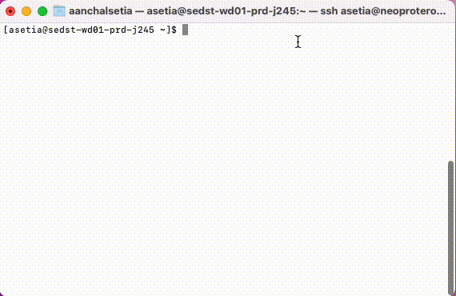
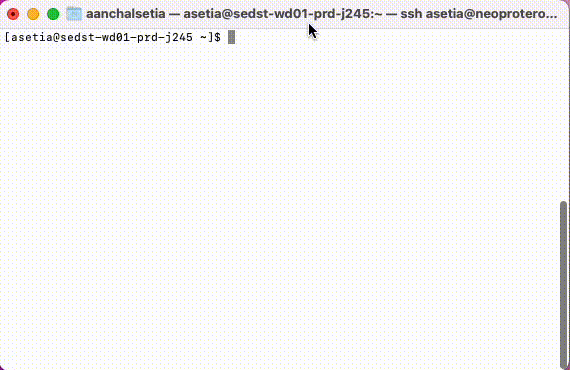
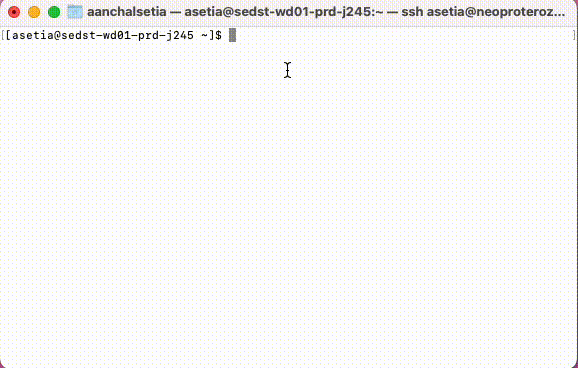
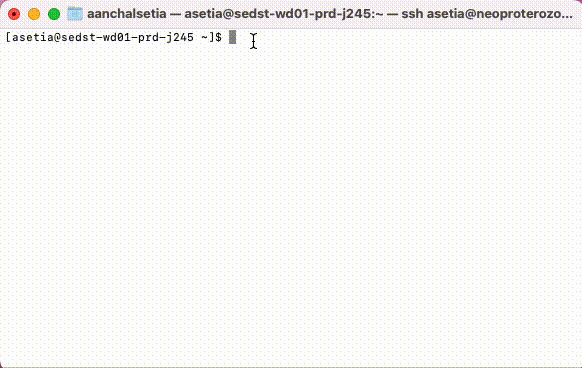

<div align="center">
  <h1>Instructions on Downloading the GRACE & GLDAS Data</h1>
</div>

The goal of this notebook is to provide instructions for:

- Downloading these specific datasets:
  1. JPL GRACE and GRACE-FO Mascon Ocean, Ice, and Hydrology Equivalent Water Height Coastal Resolution Improvement (CRI) Filtered Release 06.1 Version 03
     **[Time Range: April 2002 till April 2023]**
  2. GLDAS Noah Land Surface Model L4 monthly 0.25 x 0.25-degree V2.1.
     **[Time Range: Jan 2000 to March 2023]**

- Downloading multiple versions of GRACE & GLDAS data & potentially other datasets of interest hosted on NASA Earth Data.

<div align="center">
  <h2>Section I: Downloading GRACE & GLDAS Data (needs python >= 3.7)</h1>
</div>

<b>Step 1:</b>  Register for an Account  

To access the data, you need to register for an account at [https://urs.earthdata.nasa.gov](https://urs.earthdata.nasa.gov). Follow the instructions on the website to create your profile. Follow the instructions on the website to create your profile.

 <b>Step 2:</b> To download both <b>GRACE & GLDAS dataset</b>, download the shell file from <a href="https://github.com/uwescience/DSSG2023-Groundwater/blob/main/scripts/data/download_data.sh"><b>here</b></a>. If you are only interested in downloading <b>GRACE</b>, download its shell file from <a href="https://github.com/uwescience/DSSG2023-Groundwater/blob/main/scripts/data/download_grace_data.sh"><b>here</b></a>. If you are only interested in downloading <b>GLDAS</b>, download its shell file from <a href="https://github.com/uwescience/DSSG2023-Groundwater/blob/main/scripts/data/download_gldas_data.sh"><b>here</b></a>.

 <b>Step 3: </b> Open the terminal and run <code>echo `$HOME`</code>, then <code>pwd</code>. Make sure the two locations are the same.
 
 
 
<b>Step 4:</b>  Create and Configure .netrc File

To set up your `.netrc` file for accessing [https://urs.earthdata.nasa.gov](https://urs.earthdata.nasa.gov), follow these steps:

1. Create and open the `.netrc` file at the desired location with the following commands:

```bash{style="background-color: #f0f0f0"}
touch .netrc   # creates the file
nano .netrc    # opens the file in the nano text editor
```

2. In the `.netrc` file, enter the following information:

```bash
machine urs.earthdata.nasa.gov
login <your username>
password <your password>
```

3. Type the command: `chmod +x download_data.sh` and press Enter.



<b>Step 5:</b>  Download the Dataset

To download the dataset using the downloaded shell file in the terminal, follow these steps:

1. In the terminal, navigate to the folder where the shell file is downloaded.
2. Type the command: `chmod +x download_data.sh` and press Enter.
3. Now, run the command: `./download_data.sh` to initiate the download process.



Step 6: The download will begin :D


<div align="center">
  <h2>Section II: Customising GRACE-FO and GLDAS Data</h1>
</div>


###How to download GRACE-FO data for a different time period?

The shell file contains the path to download GRACE-FO data till 2023-06-23. If you want to download data for different time points, follow these steps to edit the start or end date in the shell file:

1. In the terminal, navigate to the folder where the shell file is downloaded.
2. Open the file in a text editor using the command: `nano download_data.sh`
3. Edit the start and end dates as per your requirement.
4. Save your changes by pressing `Ctrl+O` and then confirm the filename with `Enter`.
5. Exit the text editor by pressing `Ctrl+X`.



6. Repeat Steps 3 till Steps 6 from Section I.


###How to download GLDAS data for a different time period? Or any other dataset from the NASA Earth Data?

1. Locate the most recent GLDAS dataset or any other dataset you would like to download on [https://search.earthdata.nasa.gov/](https://search.earthdata.nasa.gov/) and click on it.

2. Once selected, press the green `Download All` button. Then click `Download Data` on the next screen.

3. Wait until the download is 100% ready.

4. Click on the `Download Script` tab. Copy the provided shell script.

5. Open the previously downloaded [shell script](https://github.com/uwescience/DSSG2023-Groundwater/blob/main/scripts/data/download_data.sh). Open it in any text editor (notepad, pages, etc.). Replace the GLDAS script with the one that you just copied. Save it.

6. Repeat Steps 3 till Steps 6 from Section I.

