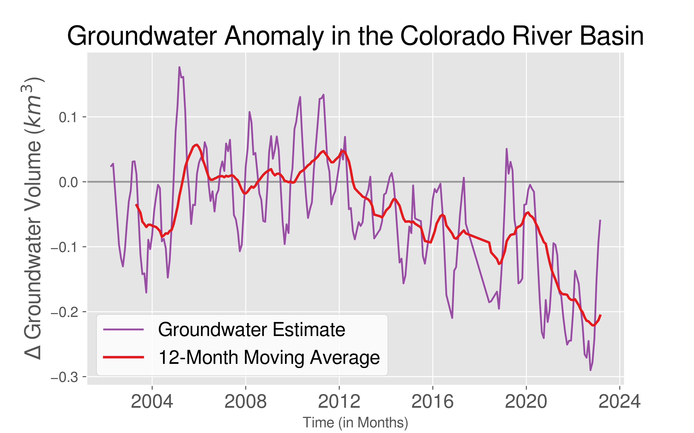
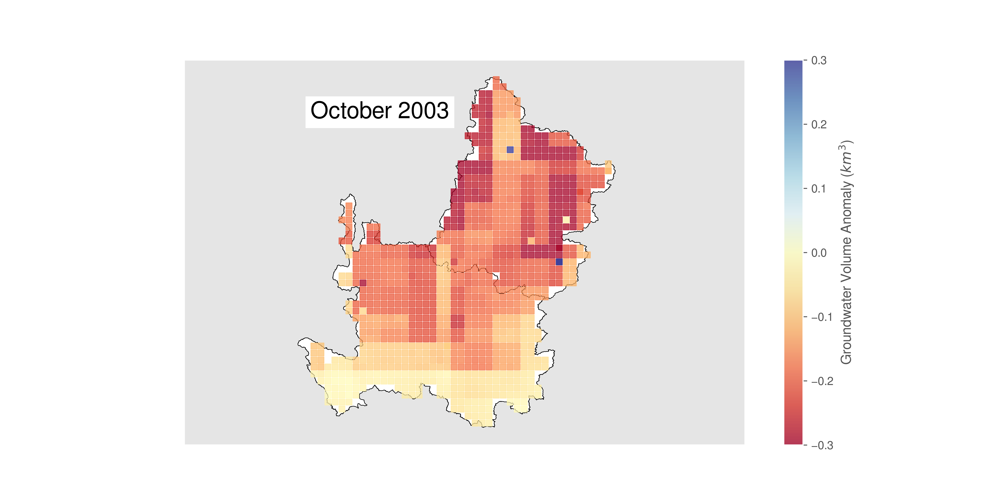

# Validating & Visualizing Your Data

>## Comparing & Contrasting Individual Variables 

>## Merging Data to Compute Groundwate Anomaly

### Aggregated Data (Representation of Entire Basin)

### Investigating Individual Pixels
#### Wet & Dry Years

    
    

    
    

#### Temporal Spatial Trends 

>## Exploring Shapefiles

### Upper Basin vs. Lower Basin

### States

### Tribal Nations

