# Visualizing 

Visualizing your outputs is a crucial step in making data digestible to the general public. Creating figures is typically much preferred to simply showing numbers. Below, we will go through some figures that may be on interest when studying groundwater in the Colorado River Basin. 

>## Comparing & Contrasting Individual Variables

Even before computing groundwater, taking a closer look at the components of the groundwater equation can be very powerful. Looking at the scale of the data gives you a sense of which variables may contribute heavily, or be relatively negligible. 

    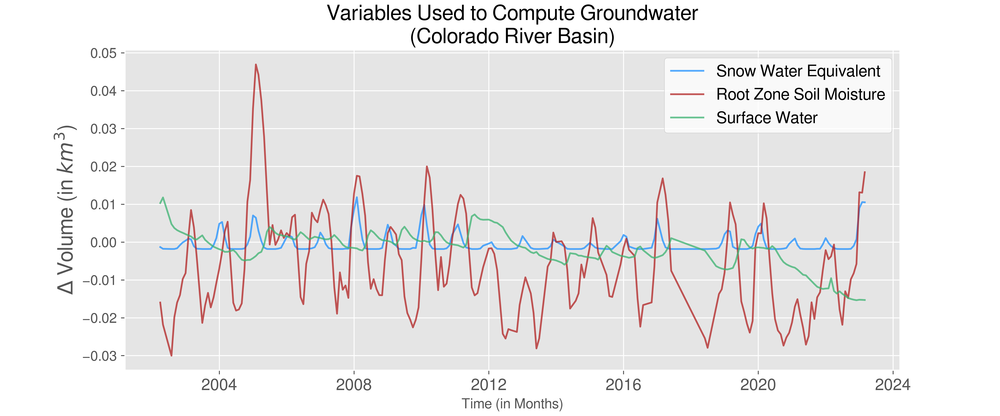
    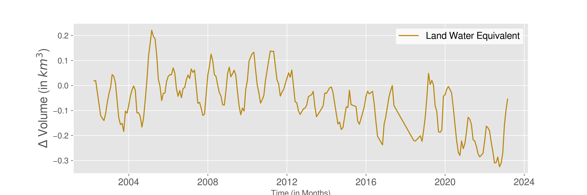

In the figures above, we note that Terrestrial Water Storage (i.e. Land Water Equivalent), is has the scale of the largest magnitude. This makes sense, as it is defined as the summation of all water on Earth's surface and subsurface. 

The variables that we substract from Terrestrial Water Storage are all on similar scales. We note that Snow Water Equivalent makes the smallest contribution to the groundwater equation, having the smallest range of values. Conversely, Root Zone Soil moisture makes the largest contribution. 

>## Merging Data to Compute Groundwate Anomaly

### Aggregated Data (Representation of Entire Basin)

Once you have computed values for groundwater, you can view trends temporally. We start by looking at groundwater over the entire Colorado River Basin (that is, we average values over all relevant pixels, i.e. those that have longtitude/latitude values lying within the CRB).

    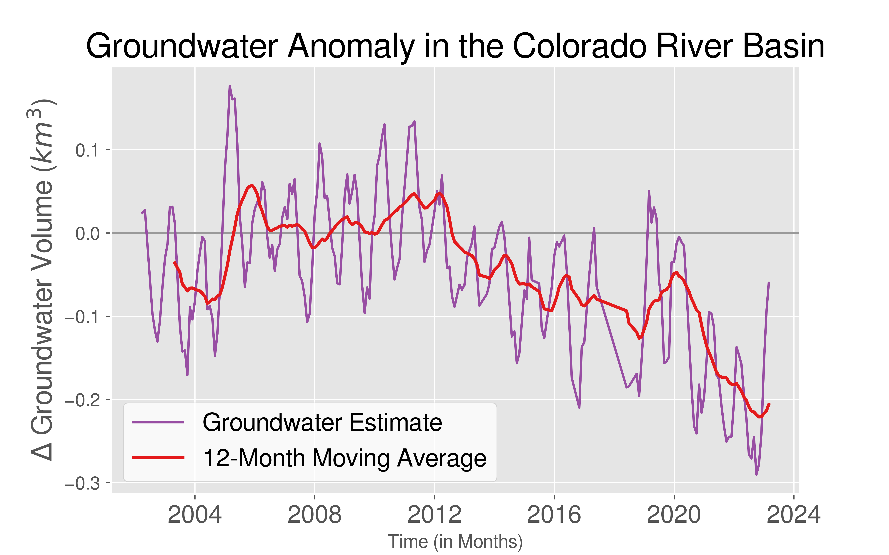

We note that there are seasonal and annual trends, shown by drops, peaks, and varying frequencies. To eliminate any bias from annual trends, we compute a 12-month Moving Average. We thus observe that starting around 2012, groundwater starts to deplete significantly and seems to be following an overall downward heading trend.

### Investigating Individual Pixels

Previously we looked at the CRB as a whole by aggregating values. We can, in addition, look at the individual pixel level at any given time. When we visualize these pixels on a spatial graph over time, we can actually visualize how groundwater is moving over time! This also allows us to look at seasonal and annual trends. 

#### Temporal Spatial Trends 

    

#### Wet & Dry Months

While moving visualizations are exciting, static images can tell important stories as well. 

In October 2003, we observe a drastic drop in groundwater. We can look at the spatial distribution of groundwater anomalies for this exact month in time. 

    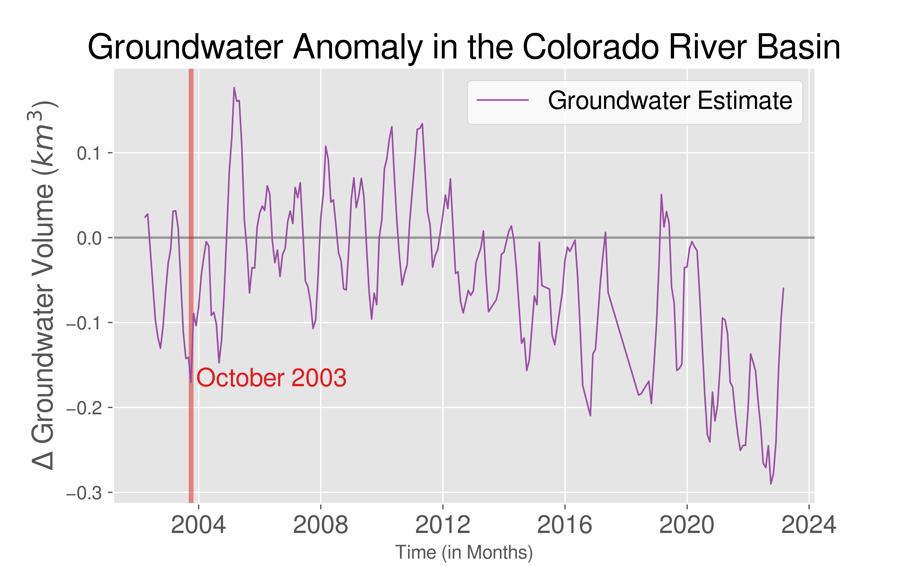
    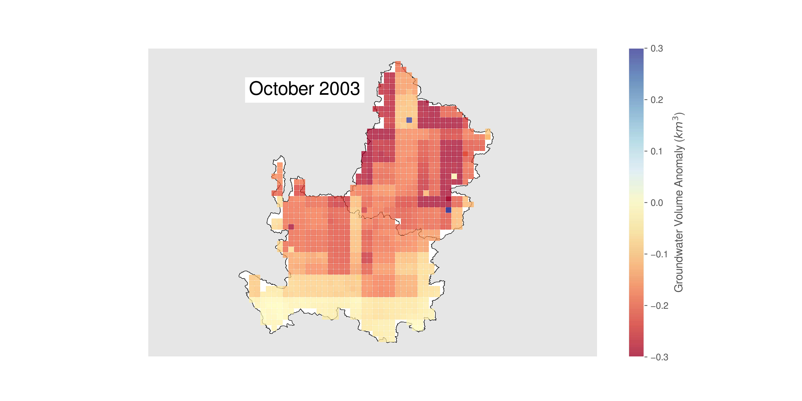

We observe that nearly the entire CRB has groundwater anomaly in the negative, meaning it was a drastically dry month compared to the average. 

We can conversely look at a very wet month, such as May 2011.

    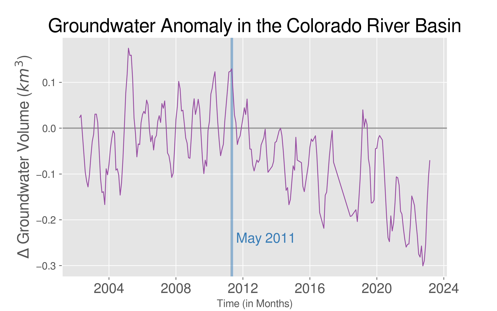
    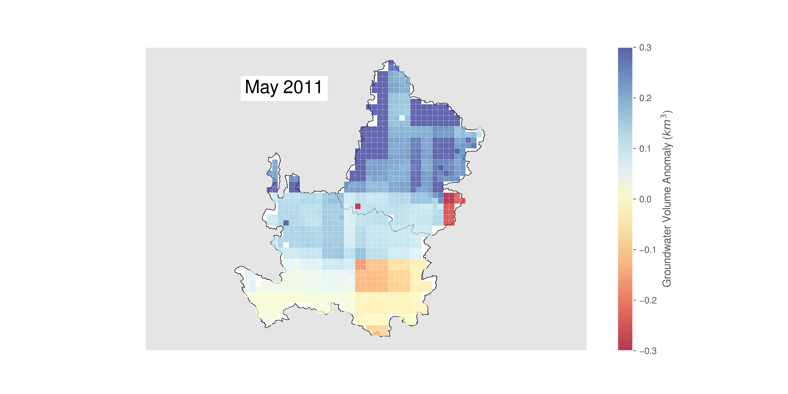

We observe that, though this was one of the wettest months in the CRB from the past 20 years, there are still regions in the Lower Basin with negative groundwater anomaly. 

>## Exploring Shapefiles

Given nearly any accurate shapefile for a region of interest, we can compute groundwater anomolies. Even when examining the Colorado River Basin, there are a number of different shapefiles (and corresponding regions) that we can explore.

### Upper Basin vs. Lower Basin

To start, we can look at trends in the Upper Basin versus within the Lower Basin. Though the division between the Upper and Lower basins was decided politically, there are significant distinctions between the two. 

    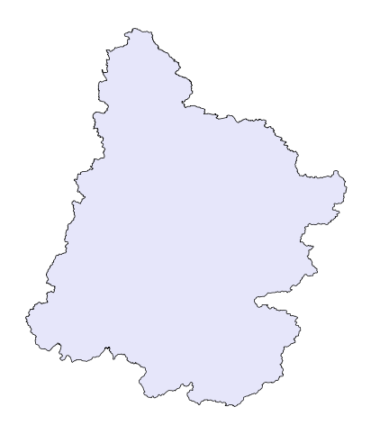
    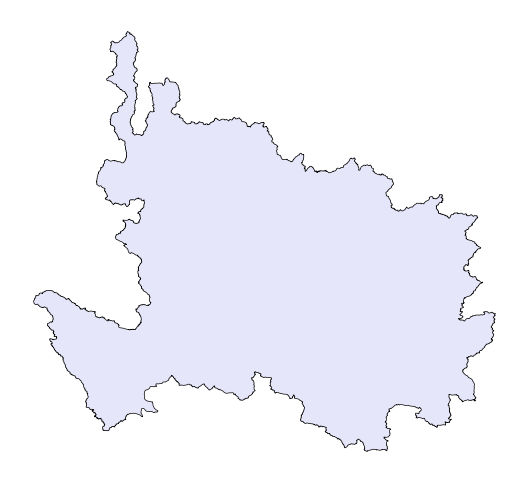
    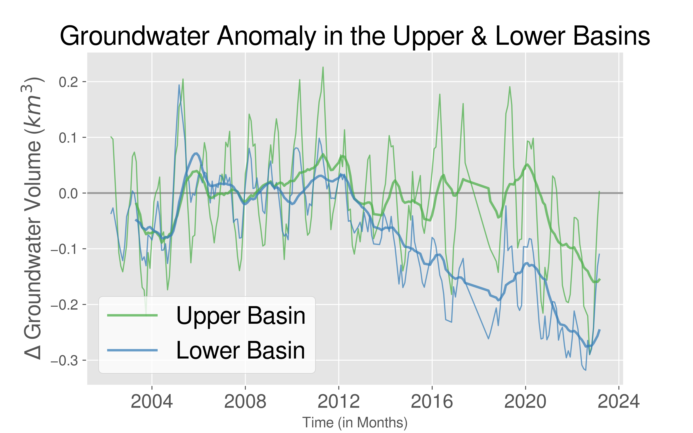

For both the Upper and Lower basin, we observe that as time advances, there is a decrease in groundwater anomaly. This trend starts around 2012 for the Lower Basin, but not till about 2020 for the Upper Basin. The Upper Basin is mountainous in geography when compared to the Lower Basin, while the Lower Basin is more desertlike. 

### States 

The CRB spans seven states in the United States, though they are not all fully contained within the boundary of the CRB. These states vary in size, population, and agriculture, to name a few. 

    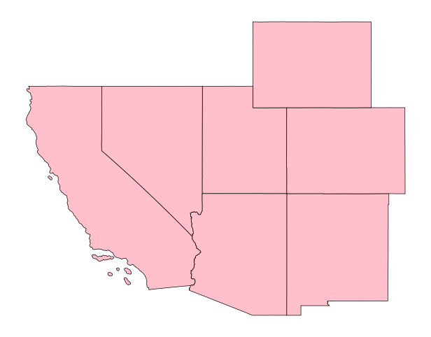

    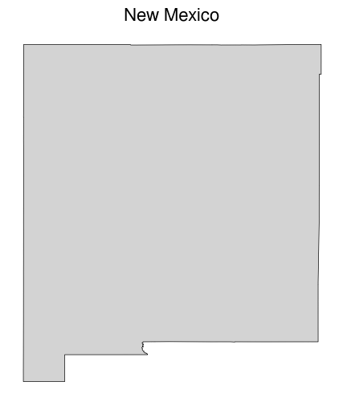
    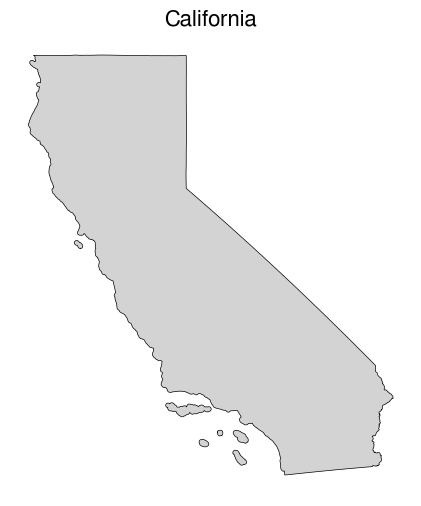
    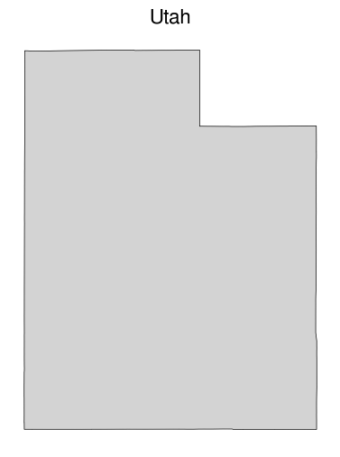
    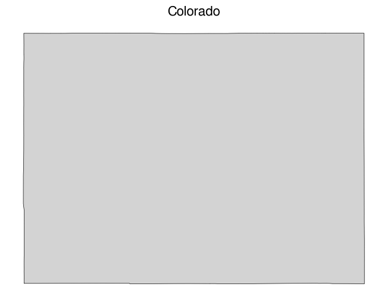
    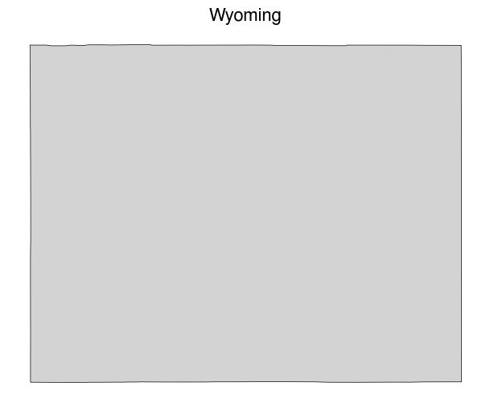
    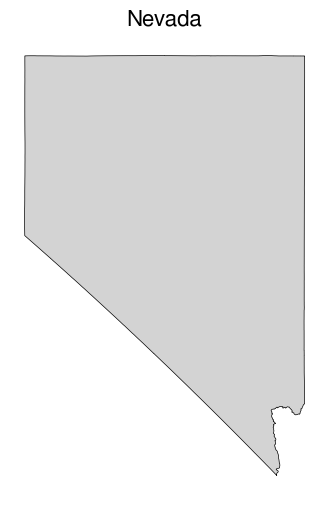
    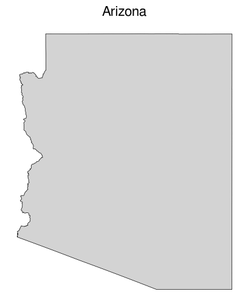

    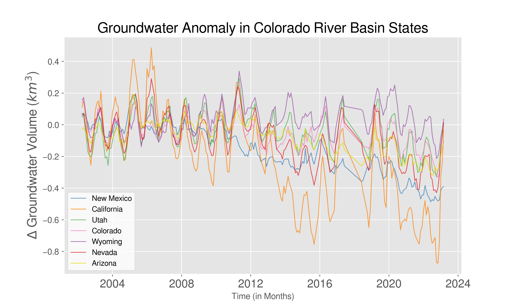
    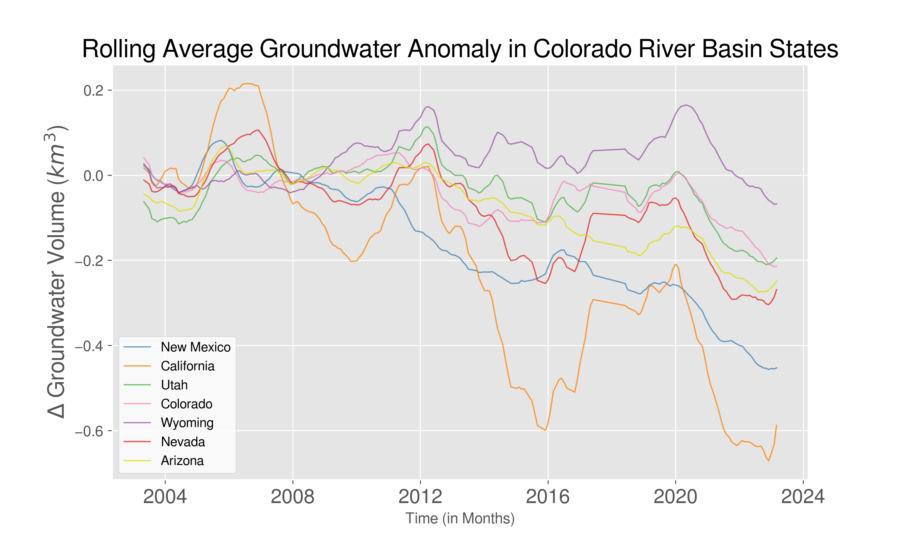

We note that Wyoming has the highest overall groundwater anomaly[^1]. Eventhough the trend for the CRB (aggregated) leans negative, Wyoming starts positive for nearly every month. Conversely, we observe that California is facing the largest amount of groundwater depletion, which aligns with the historic drought the state has been facing. 

[^1]: Please note that these groundwater estimates are shown without surface water included.