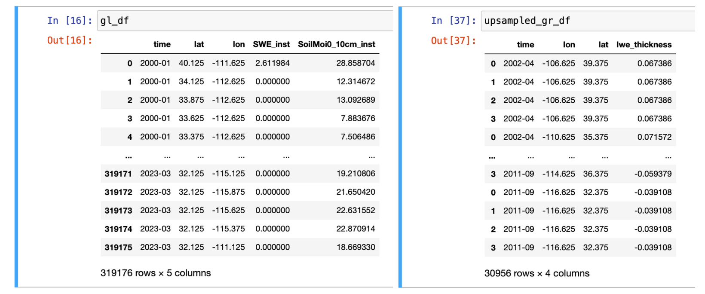
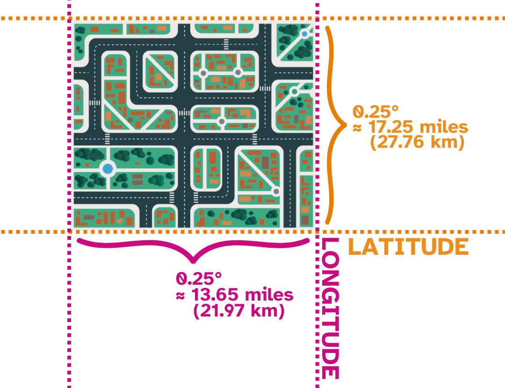
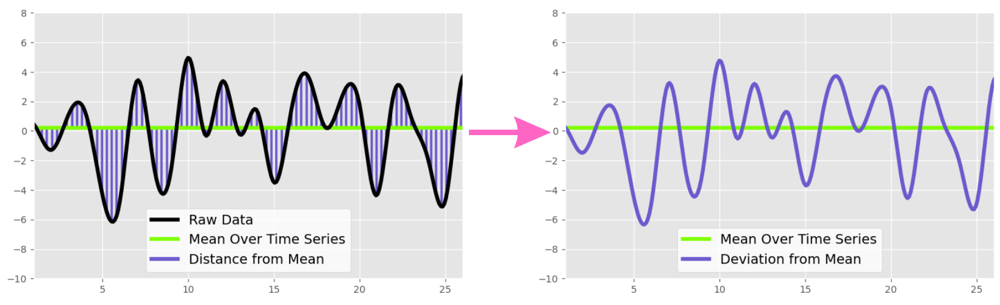

At this point, you have:
1. Defined your question
2. Reviewed GRACE/GLDAS 
3. Determined which data sources to get your data from
4. Downloaded your data
5. Organized, subsetted, and processed your data
6. Validated your outputs

Let's now take a step back to understand what our data looks like and how to interpret it.

# Data Structure
You now have your data in the form of two Pandas **dataframes**: one containing data from GRACE/GRACE-FO and one containing data from GLDAS. This can also be thought of as being in a tabular format, which can be easily saved as a .CSV file. 

     

# Variables

## Time
The time granularity for the GRACE and GLDAS datasets we used is monthly. This means that each measurement represents an entire month. 

## Longitude & Latitude
Latitude is the measurement of distance North or South of the Equator. Similarly, longitude is the measurement of distance East or West of the equator. Longitude and latitude degrees are continuous, meaning that you can be very exact when measuring location. For example, the exact coordinates for the Four Corners Monument is are 36.9990° N, 109.0452° W. 

Our GLDAS data (and GRACE data after upsampling) is given with a granularity of 0.25° (for both longitude and latitude). 

Each "pixel" thus represents a chuck of land approximately 235.46 miles squared ($\approx$ 378.94 kilometers squared).

    

## Deviation from the Mean

In order to compute the deviation from the mean ($d_i$), for each measurement $p_i$, you compute

$$d_i = p_i - \mu$$

where $\mu$ is the average value over the time series*. We then plot these distances to obtain the devations from the mean over time.

*Note that GRACE data is computed based upon a basetime time period of January 2004 to December 2009. 

    

# Sources 
[1] https://education.nationalgeographic.org/resource/latitude/
[2] https://www.usgs.gov/faqs/how-much-distance-does-a-degree-minute-and-second-cover-your-maps#:~:text=One%20degree%20of%20latitude%20equals,one%20second%20equals%2080%20feet.